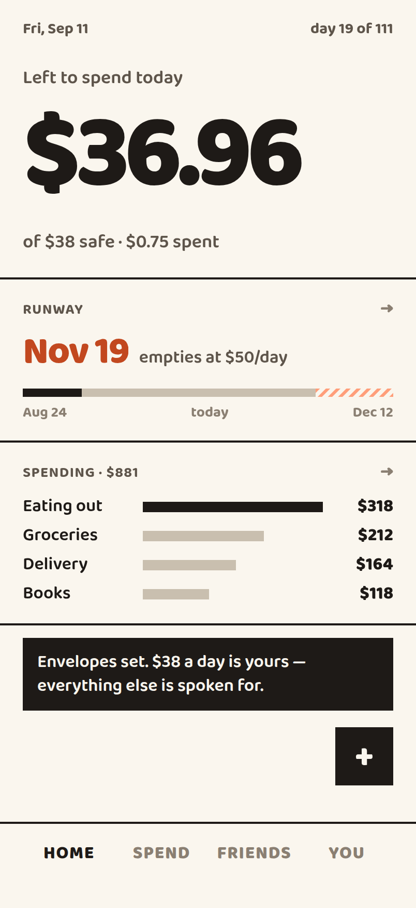
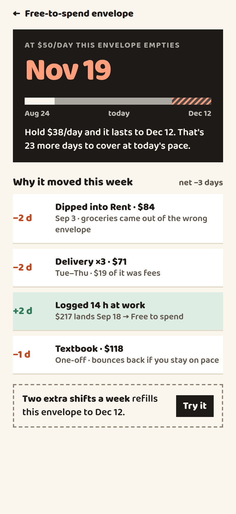
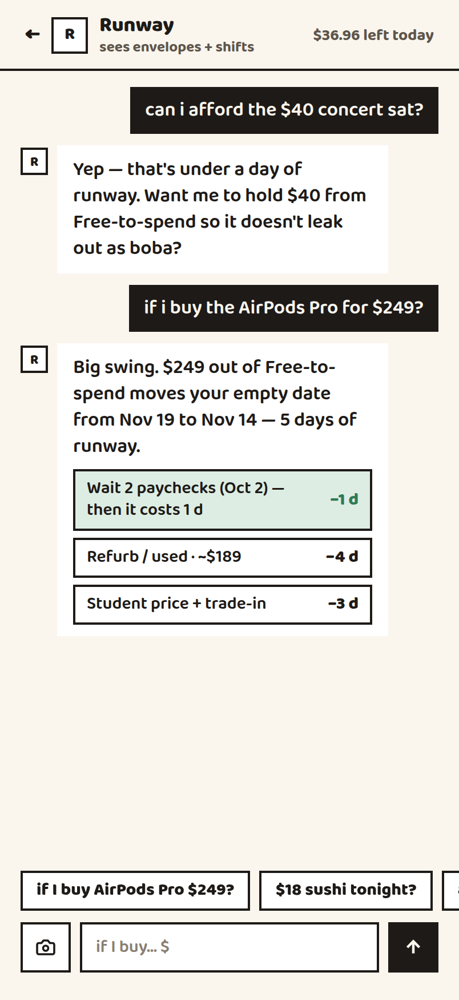
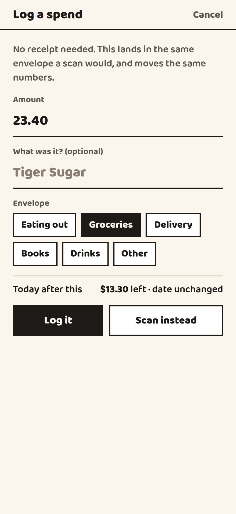
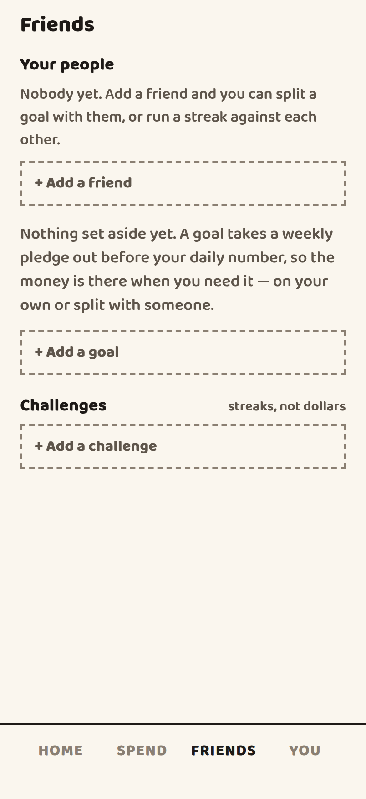
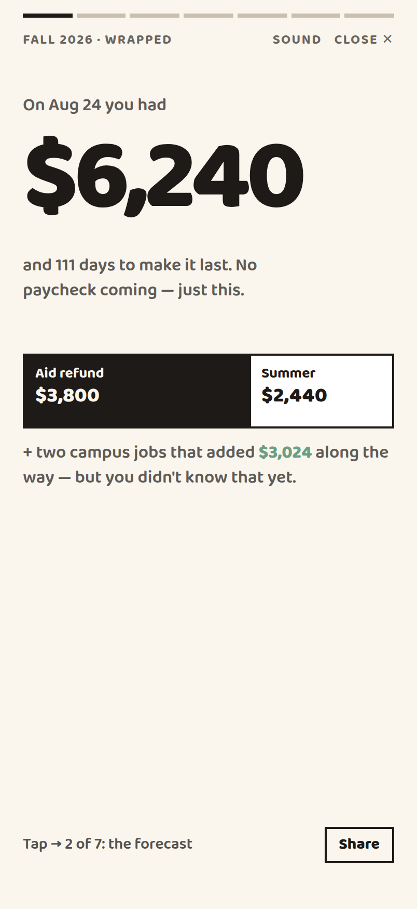

# Semester Runway

**Aid refunds and summer earnings land as one lump in August, and people are broke by November.**

Budget apps assume a monthly paycheck. Students don't have one — they have a single
pile of money in August that has to last 111 days. Semester Runway sorts that lump
into envelopes, gives you one number for what today can cost, and tells you the date
you run out — and why that date moved.

<p>
  
  
  
</p>
<p>
  
  
  
</p>

## What it does

- **One number, not a budget.** *Left to spend today* is the free envelope divided by
  the days remaining. It shrinks correctly toward the end of term.
- **A run-out date that explains itself.** "Nov 15" is an accusation on its own, so
  every move is attributed: dipped into rent (−2 days), logged 14 hours at the
  library (+2 days).
- **Envelopes first.** Rent, fees and anything you're saving for are carved out
  *before* the daily number exists, so the trip fund never competes with boba.
- **What-ifs, priced in days.** Ask about a $249 purchase and the coach answers in
  runway — 5 days — with cheaper routes. Drag your shift hours and the date moves
  under your thumb.
- **A coach that can't do arithmetic.** Gemini gets the projection engine as callable
  what-ifs and may only quote the strings they hand back. It decides *which* question
  you're asking; the engine decides what's true. Chips under each reply name the
  what-ifs it ran.
- **Point the camera, or just type it.** Gemini reads the merchant, total and line
  items off a receipt. No receipt — a vending machine, a Venmo split — and manual
  entry lands the same charge in the same envelope.
- **More than one campus job.** Each has its own rate, hours and pay cadence, because
  two paychecks landing on different days is exactly what makes the date wander.
- **Funds vs. challenges.** A shared fund is real money everyone pledges weekly. A
  challenge is a streak with no dollars attached. Skipping a boba doesn't pay for a
  trip, and the app never pretends it does.
- **Semester Wrapped.** Seven story cards where every figure is something the ledger
  can actually prove, and money is *earned* or *saved* — never merged into one number.

## Running it

```sh
cd mobile
npm install
npm start        # press i for the iOS simulator, or scan the QR with Expo Go
```

```sh
npm run web           # no simulator needed — opens phone-sized in your browser
npm test              # the engine's contract + the AI layer, on plain Node
npm run typecheck
npm run gemini:doctor # checks your key, egress, and the model id
```

**Optional:** copy `mobile/.env.example` to `mobile/.env.local` and add a
[Gemini key](https://aistudio.google.com/apikey) to turn on real receipt reading
and the grounded coach. Without one the app runs exactly the same, with a demo
receipt parse and the built-in coach heuristic — every AI path has a non-AI
fallback, on purpose.

Expo SDK 57 · React Native 0.86 · React 19.2. The camera needs a real device; in a
simulator or browser the receipt scanner falls back to a placeholder viewfinder and
still parses.

The web build deliberately renders at phone size (402×874, centered) instead of
filling the window, so a laptop shows you the real thing. Narrow the window past
440px and it goes full-bleed like a phone.

## How it's built

```
mobile/
  app/            routes (expo-router), one file per screen
  src/domain/     pure logic — no React, no I/O
  src/data/       one API boundary: mock today, HTTP client ready,
                  gemini/ decorating whichever store is underneath
  src/theme/      design tokens
  src/ui/         design-system primitives
project/          the Claude Design handoff the app was built from
chats/            the design conversation behind it
```

**The projection engine is the product.** `project(snapshot)` is a pure function:
lump − bills still owed − fund pledged − spent, over the days remaining. Because it's
pure, the jobs slider and the coach both run it against a *modified copy* of the
snapshot and compare run-out dates rather than reimplementing the arithmetic — so
nothing in the app can quote a number the rest of it disagrees with.

**One seam to a real backend.** Every screen goes through `RunwayApi`; only
`src/data/client.ts` knows which implementation it gets. Today that's an in-memory
mock holding a demo semester. Set `EXPO_PUBLIC_API_URL` and it's the HTTP client
instead, with no change above the boundary — `src/data/http/httpApi.ts` documents the
endpoints a server has to serve.

Mutations return the whole snapshot rather than a patch, because everything here
ripples: logging an $8.65 boba moves today's remainder, the category bars, and a
streak.

**The model never owns a number.** `src/data/gemini/` is a decorator over that same
boundary: it overrides exactly two methods — reading a receipt and answering a
what-if — and delegates all state untouched. The coach is handed the projection
engine as tools (`src/domain/tools.ts`) whose results are pre-formatted strings, and
told it may quote those and nothing else. So it can be wrong about tone and cannot be
wrong about money.

## State of things

`tsc` clean · 42/42 tests, the projection engine pinned to the design’s own figures ·
iOS, Android and web bundles all build · no console errors across any screen.

**Real:** Supabase behind the same `RunwayApi` contract, with email auth (magic link
or a 6-digit code), row-level security, cross-user invites you actually accept on a
second account, and a `pg_cron` daily tick that advances streaks server-side. Switch
to it with `EXPO_PUBLIC_USE_MOCK=false`; leave it unset and the in-memory mock runs
instead, which is what the screenshots above show.

**Still stubbed:** **Share** on the Wrapped cards, and Wrapped itself — a fixed
end-of-term recap rather than one derived from your live semester.

**Picking this up?** [`STATE.md`](STATE.md) is the working handoff: what's real, what's
stubbed, the known rough edges, and the handful of things that look wrong and aren't.
[`docs/demo-script.md`](docs/demo-script.md) is the 90-second walkthrough.

See [`mobile/README.md`](mobile/README.md) for the fuller engineering notes and
[`HANDOFF.md`](HANDOFF.md) for the original design-handoff instructions.
