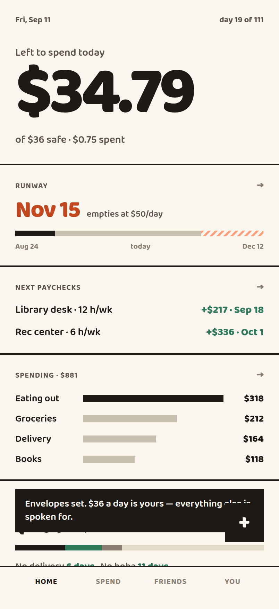
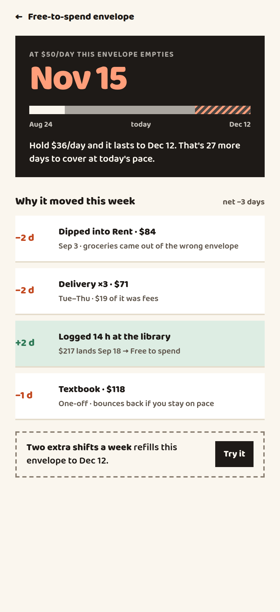
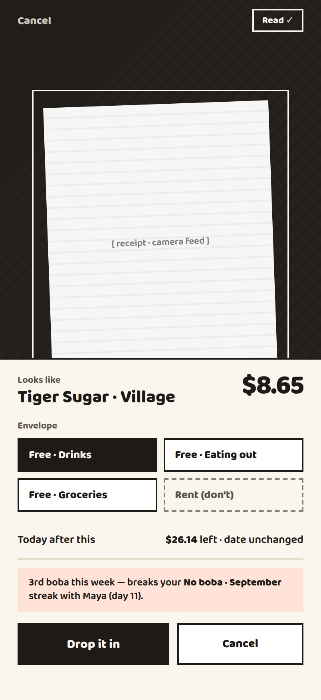
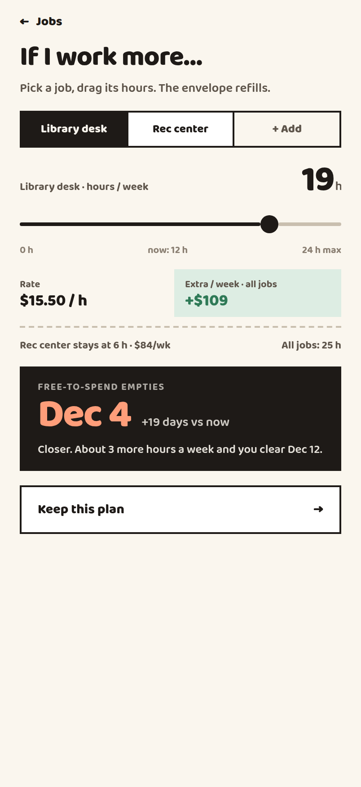
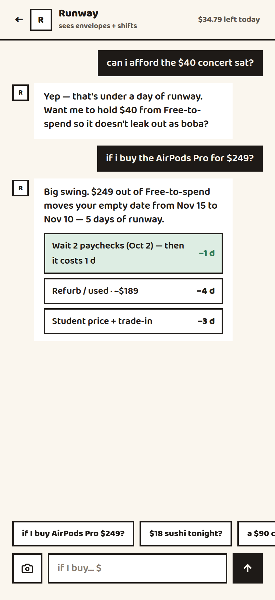
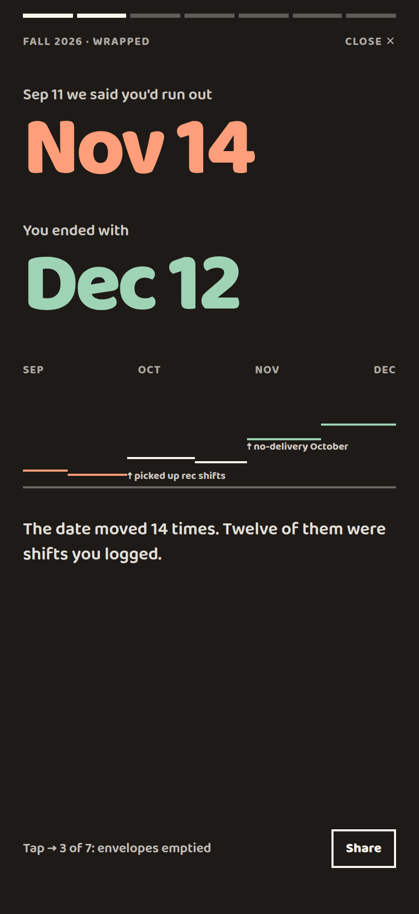

# Semester Runway

**Aid refunds and summer earnings land as one lump in August, and people are broke by November.**

Budget apps assume a monthly paycheck. Students don't have one — they have a single
pile of money in August that has to last 111 days. Semester Runway sorts that lump
into envelopes, gives you one number for what today can cost, and tells you the date
you run out — and why that date moved.

<p>
  
  
  
</p>
<p>
  
  
  
</p>

## What it does

- **One number, not a budget.** *Left to spend today* is the free envelope divided by
  the days remaining. It shrinks correctly toward the end of term.
- **A run-out date that explains itself.** "Nov 15" is an accusation on its own, so
  every move is attributed: dipped into rent (−2 days), logged 14 hours at the
  library (+2 days).
- **Envelopes first.** Rent, fees and anything you're saving for are carved out
  *before* the daily number exists, so the trip fund never competes with boba.
- **What-ifs, priced in days.** Ask about a $249 purchase and the coach answers in
  runway — 5 days — with cheaper routes. Drag your shift hours and the date moves
  under your thumb.
- **More than one campus job.** Each has its own rate, hours and pay cadence, because
  two paychecks landing on different days is exactly what makes the date wander.
- **Funds vs. challenges.** A shared fund is real money everyone pledges weekly. A
  challenge is a streak with no dollars attached. Skipping a boba doesn't pay for a
  trip, and the app never pretends it does.
- **Semester Wrapped.** Seven story cards where every figure is something the ledger
  can actually prove, and money is *earned* or *saved* — never merged into one number.

## Running it

```sh
cd mobile
npm install
npm start        # press i for the iOS simulator, or scan the QR with Expo Go
```

```sh
npm run web      # no simulator needed — opens phone-sized in your browser
npm test         # the projection engine's contract, on plain Node
npm run typecheck
```

Expo SDK 57 · React Native 0.86 · React 19.2. The camera needs a real device; in a
simulator or browser the receipt scanner falls back to a placeholder viewfinder and
still parses.

The web build deliberately renders at phone size (402×874, centered) instead of
filling the window, so a laptop shows you the real thing. Narrow the window past
440px and it goes full-bleed like a phone.

## How it's built

```
mobile/
  app/            routes (expo-router), one file per screen
  src/domain/     pure logic — no React, no I/O
  src/data/       one API boundary: mock today, HTTP client ready
  src/theme/      design tokens
  src/ui/         design-system primitives
project/          the Claude Design handoff the app was built from
chats/            the design conversation behind it
```

**The projection engine is the product.** `project(snapshot)` is a pure function:
lump − bills still owed − fund pledged − spent, over the days remaining. Because it's
pure, the jobs slider and the coach both run it against a *modified copy* of the
snapshot and compare run-out dates rather than reimplementing the arithmetic — so
nothing in the app can quote a number the rest of it disagrees with.

**One seam to a real backend.** Every screen goes through `RunwayApi`; only
`src/data/client.ts` knows which implementation it gets. Today that's an in-memory
mock holding a demo semester. Set `EXPO_PUBLIC_API_URL` and it's the HTTP client
instead, with no change above the boundary — `src/data/http/httpApi.ts` documents the
endpoints a server has to serve.

Mutations return the whole snapshot rather than a patch, because everything here
ripples: logging an $8.65 boba moves today's remainder, the category bars, and a
streak.

## State of things

`tsc` clean · 16/16 projection tests, pinned to the design's own figures · iOS,
Android and web bundles all build · no console errors across any screen.

**Picking this up?** [`STATE.md`](STATE.md) is the working handoff: what's real, what's
stubbed, the known rough edges, and the handful of things that look wrong and aren't.

Stubs behind a real surface: **Share** on the Wrapped cards, the `+ Add` affordances
for bills, goals, jobs and friends, and auth. Receipt OCR is server-side by design —
the camera captures and uploads, but the mock returns a fixed parse.

See [`mobile/README.md`](mobile/README.md) for the fuller engineering notes and
[`HANDOFF.md`](HANDOFF.md) for the original design-handoff instructions.
